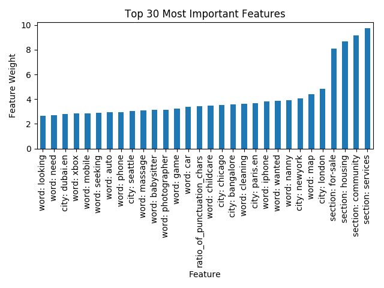
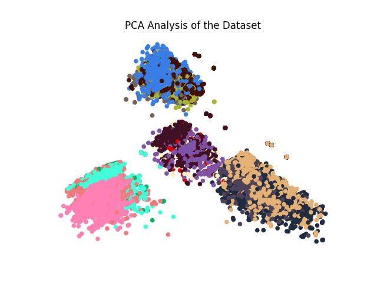
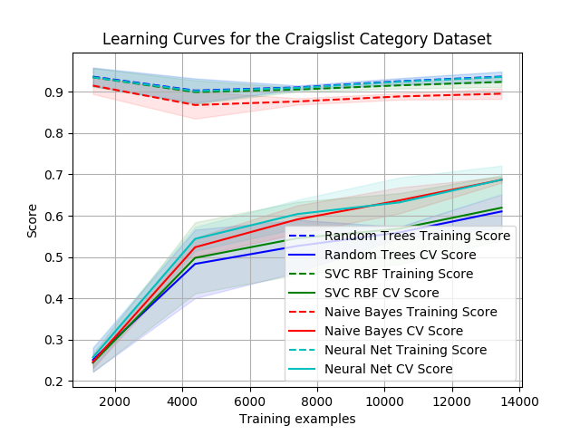

## Summary

This project solves the following HackerRank problem:
https://www.hackerrank.com/challenges/craigslist-post-classifier-the-category

> Craigslist is a powerful platform and forum for local classified advertisements.
It has 9 prominent sections: jobs, resumes, gigs, personals, housing, community,
services, for-sale and discussion forums. Each of these sections is divided
into subsections called categories. For example, the services section has
the following categories under it: beauty, automotive, computer, household, etc.

> Each category belongs to only 1 section. Given the city, section and heading
of a Craigslist post, can you predict the category under which it was posted?

## Analysis

#### Top Features

For additional information about the dataset, code for determining
the most important features is also included. Here is a graph generated
by that code:

Without any surprise the graph demonstrates that the section features
are the most important ones by far.

#### PCA

To have a simple visual representation of the data, it is convenient
to plot a 2D PCA version of the dataset. Unfortunately, after extracting
all of the necessary features, the dataset has 100,000 dimensions. Since
PCA is roughly O(d3) computing a 2D PCA reduction becomes
impractical, unless a different is used to reduce the dimensionality
prior to feeding the dataset to PCA, which is exactly what I have done.
I have used a SVM to determine the most important features and only keep
1000 of these before using PCA. Here is the final result:

As expected, the sections are well separated while the categories are
harder to distinguish from each other.

#### Model Performance

To solve the prediction problem I have tried using the following models:
- Naive Bayes
- Random Trees
- Neural Nets
- SVM with a RBF kernel

Below you can find the performance of the above-mentioned models:

