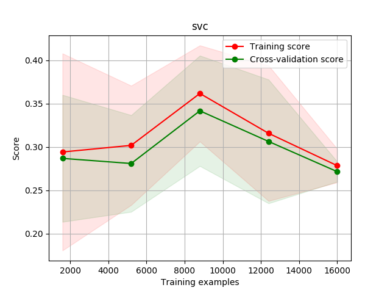
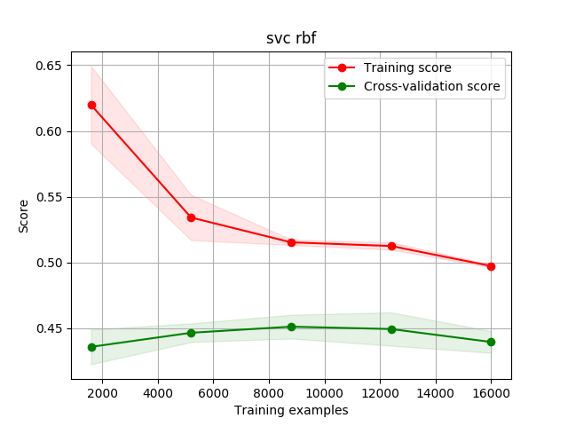
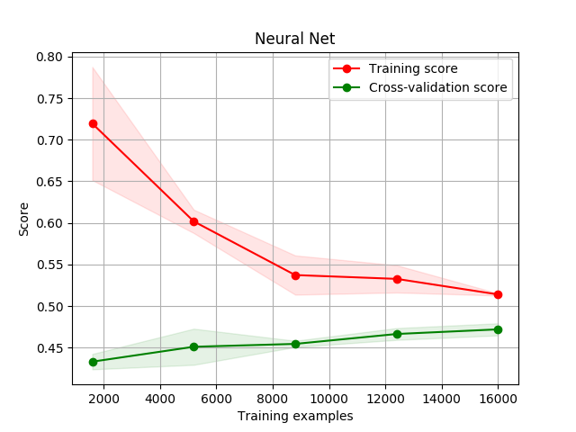

### Overview
This project uses "default of creadit card clients" data set from the
[UCI data set collection](https://archive.ics.uci.edu/ml/datasets/default+of+credit+card+clientsi).
It attempts to predict when a customer is going to default on the next
payment.

### Evaluated Predictors
So far I have attempted to use the following predictors with grid search
for meta parameter optimization:
 * Stochastic Gradient Descent
 * Linear Support Vector Classifier
 * Support Vector Classifier with an RBF Kernel
 * K-Nearest Neighbours
 * Neural Network

As can be seen from the following learning curves:

Neural nets, SVC-RBF and KNN classifiers exhibit the best performance
for the current problem.