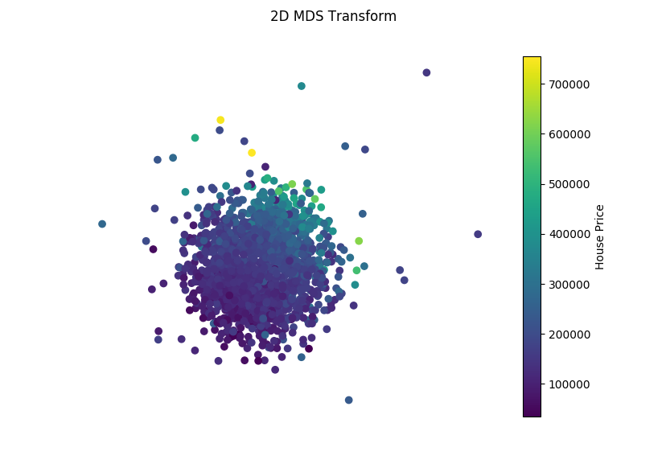
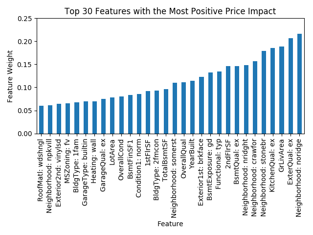
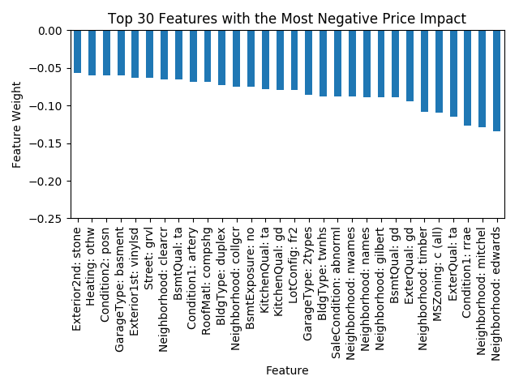
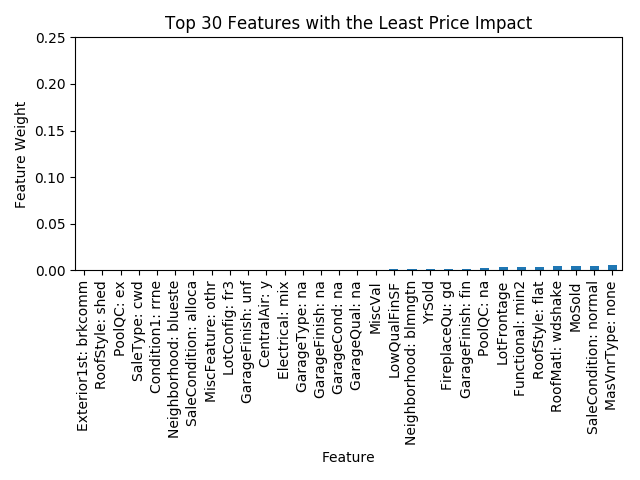
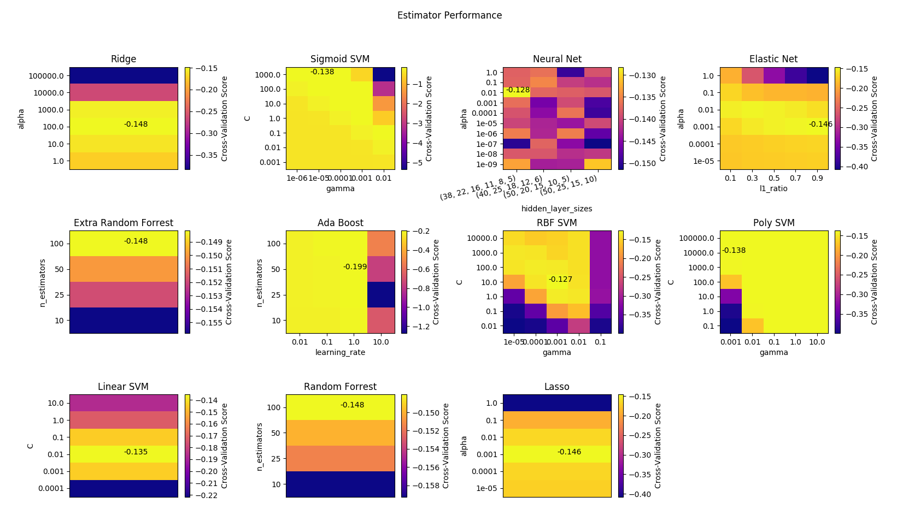

## Summary

This projects solves the Kaggle House Prices problem
which is available [on their website](https://www.kaggle.com/c/house-prices-advanced-regression-techniques).
In addition, I perform analysis of the dataset.

### MDS Transform Plot
To get a better understanding of the data let's reduce the dataset to
2 dimensions and plot it. MDS algorithm seems to produce very good results for
the dataset - here is what we get:

From the plot it can seen that there is a clear pattern in the data, even
in 2 dimensions (notice the strong gradient from low price on one end
of the plot to high price on the other end). This suggests that we
should be able to accurately predict the house price from the current features.

### Feature Analysis
To analyse the features of the dataset, I have trained a linear SVM and
extracted the weights assigned by the SVM to each feature. These can
be interpreted as relative feature importance values.

#### Features With the Most Positive Impact on the House Price

As expected, Neighbourhood has a significant impact on the price of a
house and it comes without a surprise that certain neighbourhoods
dramatically increase the house price.

We can see that apart from neighbourhood excellent exterior material quality,
living area and excellent kitchen quality appear to have the most impact on the price.

#### Features With the Most Negative Impact on the House Price

As discussed above, since neighbourhood has a significant price impact,
having a house in a poor neighbourhood dramatically reduces the price
of a house.

It appears that being adjacent to the East-West railroad (Condition1: rrae)
makes a house quite a bit cheaper.

Having a typical exterior material quality also has a strong negative
impact on the house price.

Having a house in a commercial zone greatly reduces its price.

#### Features With the Least on the House Price

As one can see, having a "common brick" exterior, shed roof, excellent
roof quality and an unfurnished garage seem to have no impact on the house
price.

### Predicting the House Price

#### Estimator Perfomance

I have compiled a comparison of a number of various predictors for the
house price data-set for a range of hyper-parameter values.

From the graphs, it is clear that RBF-kernel SVM and neural nets have
the best performance. Hence, I shall be concentrating on these 2
predictors later in my analysis to achieve the best prediction performance.