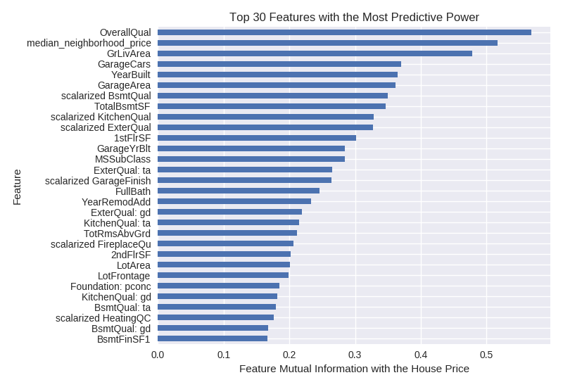
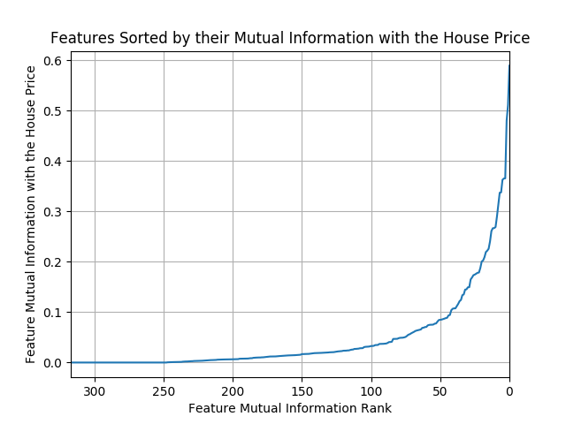
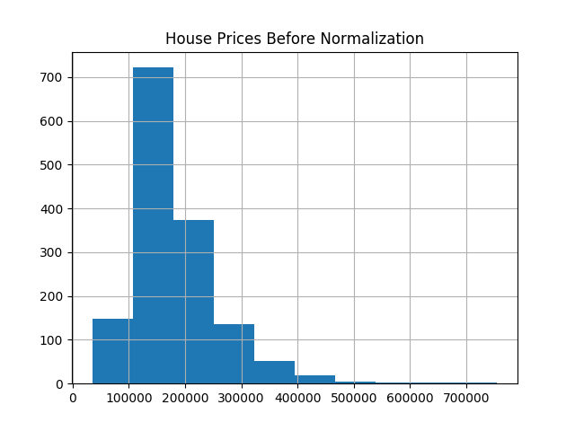
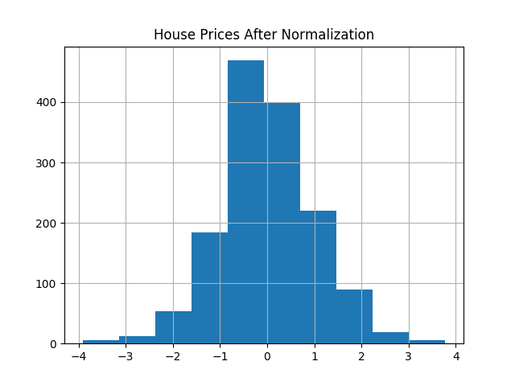
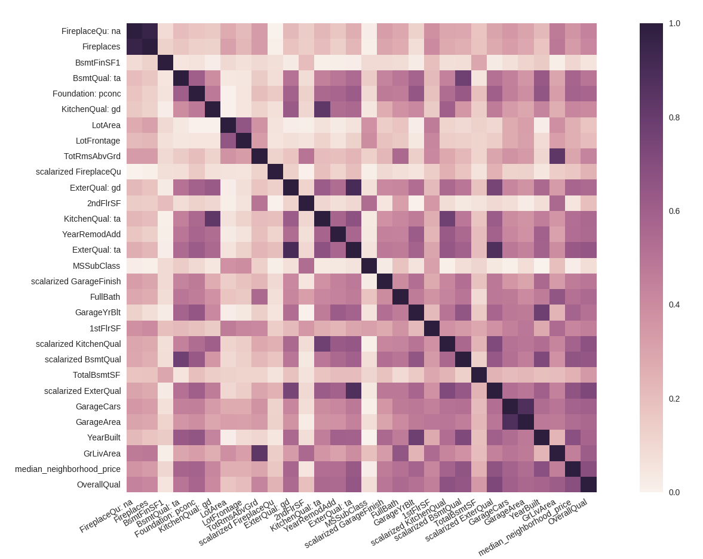
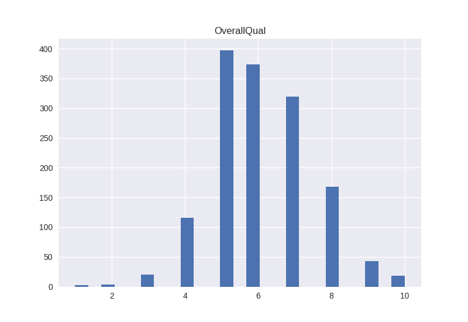
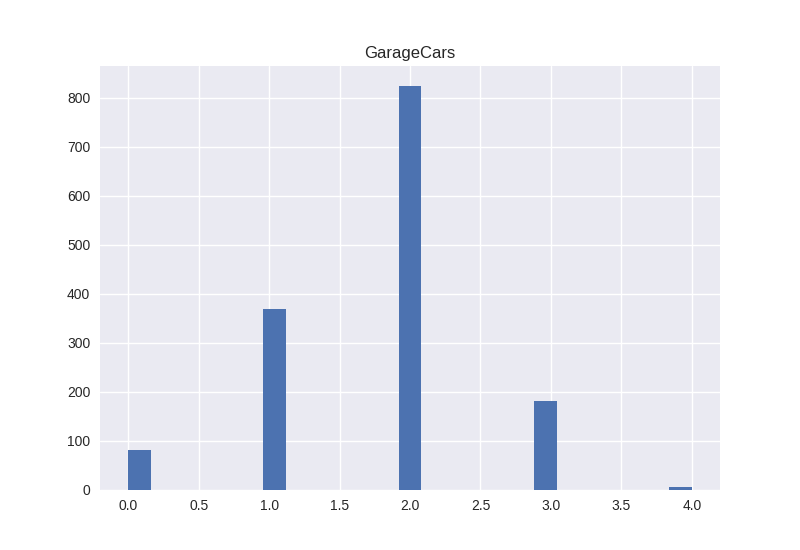
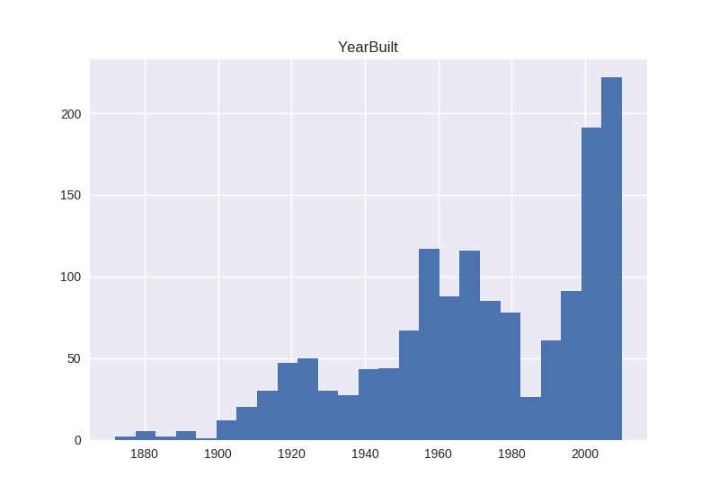
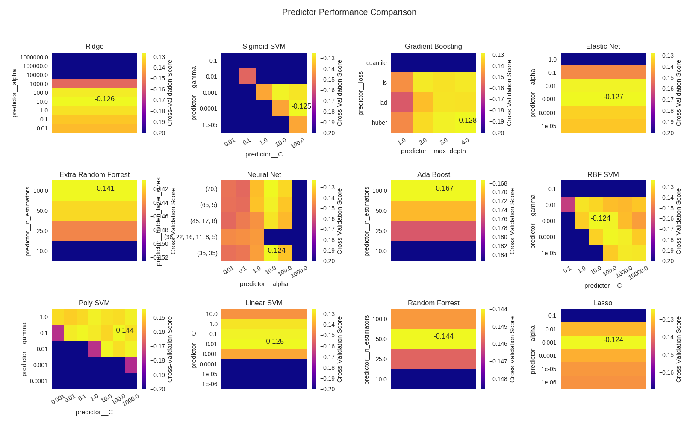
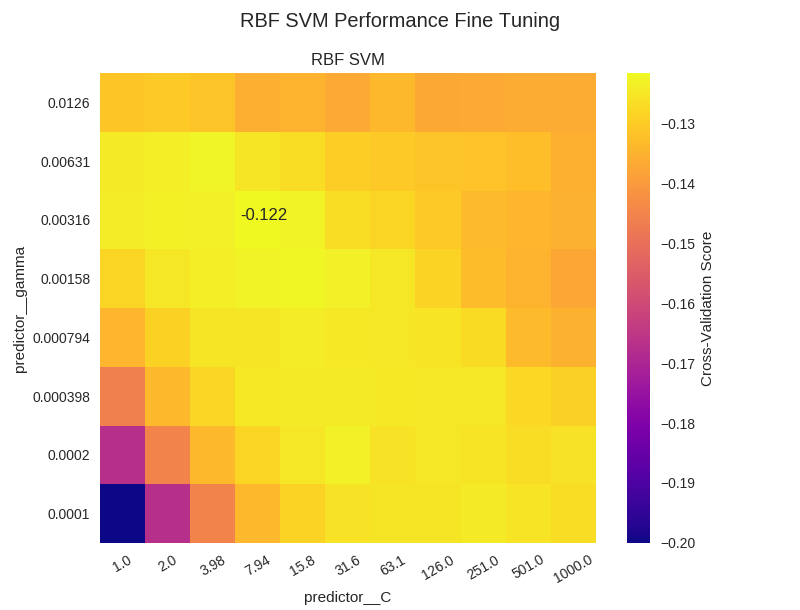

## Introduction

This project solves the "Kaggle House Prices" problem
which is available at [the Kaggle website](https://www.kaggle.com/c/house-prices-advanced-regression-techniques).
In addition to solving the prediction problem,
I perform a basic analysis of the data-set.

## Data Analysis

### MDS Transform Plot
Before I begin, I'd like to get a better understanding of the data.
I'd like to reduce the data-set to 2 dimensions and plot it.
MDS algorithm seems to produce good results for
the data - here is what I get:

From the plot it can be seen that there is a clear pattern in the data, even
in 2 dimensions (notice the strong gradient from low price on one end
of the plot to high price on the other end). This suggests that we
should be able to predict house prices fairly well from the existing features.

### Feature Importance

There are a number of ways to estimate how good a specific feature is
for predicting the house price. The simplest approach is to compute
the correlation coefficient for each feature with respect to the house price.
Below, I instead use the mutual information metric. It is superior to
the correlation coefficient because it is able to capture non-linear
relationships.

#### Features with the Most Discriminative Power

It comes with no surprise that the most important features in the
data-set according to this plot are overall house quality,
median neighbourhood house price and the living area above ground.

Surprisingly though, the number of fireplaces and
their quality (scalarized FireplacesQu and Fireplaces) seem to have a
significant predictive power when it comes to estimating the house price.

#### Feature Discriminative Power Overview

The plot demonstrates that only around 50 features have a mutual
information value of 0.1 or greater.
At the same time, about 70 features appear to have mutual
information of 0 with the house price. That renders them useless for
predicting the house price, at least in a univariate way.

### Skewed Features

Many regression models make the assumption that input data is normally
distributed. Breaking this assumption reduces performance of such models.
To minimise the performance reduction caused by skewed variables we can
use the log trick - in presence of positive skew, taking log of the data
frequently helps. Here is an example:

Above, I have also subtracted the mean after taking the log of the data.
To minimize skew in the input data, I automatically apply this
transformation to all features whose skew is above 0.6.

### Correlated Features

For some estimators, correlated features may cause increased errors.
To avoid this, let's take a look at the feature
correlation matrix (only considering important features here):

Notice the following correlated pairs:
 - `Fireplaces` & `Fireplaces: na`
 - `ExterQual: ta` & `ExterQual: gd`
 - `scalarized ExterQual` & `ExterQual: ta`
 - `GarageArea` & `GarageCars`

For these pairs, let's drop the feature which has a lower mutual
information score WRT the house price.

There are better approaches to eliminating features, however, it is
convenient to do this here since we get a better sense of the data
and the variable dependencies as a side-effect.

### Outliers

Let's consider histograms of the transformed house price and
a few of the most important features:

None of the features presented above appear to have obvious outliers.
One could argue that `GrLivArea > 5000` looks like an outlier. I am
tempted to disagree since GrLivArea appears to have a significant positive
skew.

As was the case with eliminating redundant and/or correlated features,
there are better approaches to dealing with outliers. Nevertheless,
this approach is helpful as it gives a better understanding of the
data via visual examination of the most discriminative features.
In fact, it's best to combine multiple approaches to achieve the
highest performance.

## Feature Engineering

The data-set contains a variety of feature types:
 - floating-point features, such as GrLivArea
 - integer features, such as the number of rooms above ground
 - categorical features such as neighborhood
 - what I call pseudo-categorical features e.g. ExterQual.
 I refer to these types of features this way
 since they take supposedly unrelated string values
 (e.g. 'Po', 'Fa', 'TA', 'Gd', 'Ex').
 In reality, they represent a total ordering which
 is better represented with integers.

Since scikit-learn only accepts numeric matrices as input, I need to
ensure that all of the above features are appropriately encoded into
such matrices, in order to get good prediction performance.

### Magnitude Features

These features are the easiest to deal with. All I have to do here
is apply the log-trick where skew exceeds 0.6 (found it to be a good value
using cross-validation).

### Categorical Features

I use one-hot transform to turn these features into a binary-valued matrix.

### Pseudo-Categorical Features

For each such feature, I have defined a scale. For example, here is the
scale for ExterQual - `['Po', 'Fa', 'TA', 'Gd', 'Ex']`. To turn this
feature into a numeric value, I simply map its value to the integer
position in the corresponding scale. For example, `ExterQual = 'TA'`
maps to `ExterQual = 2`.

### Median House Price per Neighbourhood Feature

The median house price feature is extracted by grouping all house prices
by the neighborhood and selecting the median price for the corresponding
neighborhood.

### Feature Scaling and Imputation

Once all of the features are converted to numerical values, they are
concatenated into a big matrix. Then the values are imputed (nans
replaced with mean) and scaled to ensure uniform variance and mean (=0)
across all features.

### Feature Selection

In addition to dropping a feature from each correlated feature pair,
I have also decided to drop 70 features with the lowest mutual information
WRT the house price. The value 70 comes from the
[Feature Discriminative Power Overview section](#feature-discriminative-power-overview).

## Predicting the House Price

### Estimator Performance

Using the features defined above, I have compiled a comparison of
a number of various predictors for the
house price data-set for a range of hyper-parameter values.
Note: the score values are clipped at 0.15 to ensure the score range is
not too high and the colormap is helpful for interpreting the results.

### RBF SVM Fine Tuning

Now that we know what range the best hyper-parameters for the RBF SVM
lie in, we can perform a more comprehensive search:

From this graph we can see that the estimator's performance peaks
at `(gamma=0.003, C=8.0)`.

Training a RBF kernel SVM on the training data-set with these
hyper-parameters and then making predictions for the test
data places our solution in the 6th
percentile of [all submissions](https://www.kaggle.com/c/house-prices-advanced-regression-techniques/leaderboard).

### Fine Tuning Other Models

TODO

### Other Attempted Approaches

TODO

### Future Work

TODO